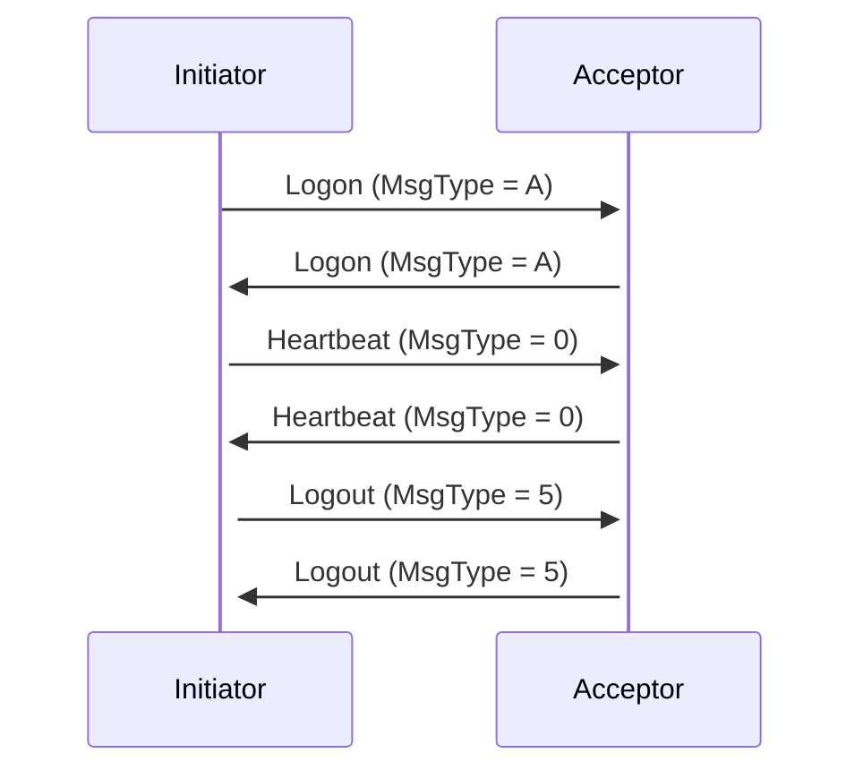
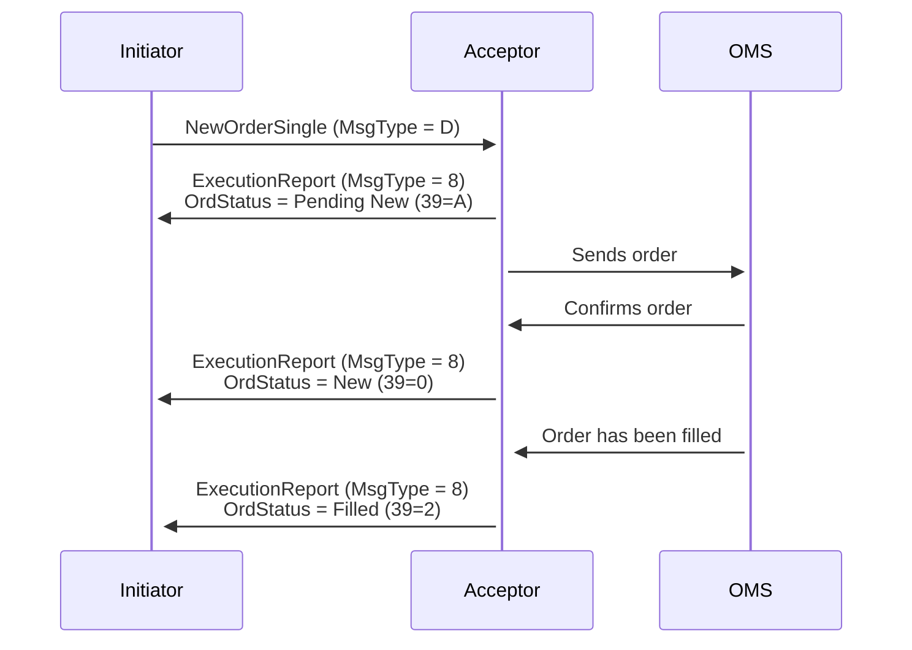
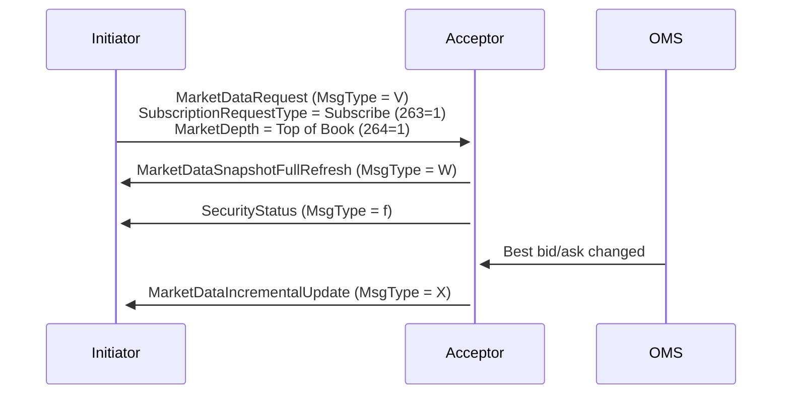

# demo-fix-initiator

## Simple Session Flow

```mermaid
sequenceDiagram
    Initiator->>+Acceptor: Logon (MsgType = A)
    Acceptor->>+Initiator: Logon (MsgType = A)
    Initiator->>+Acceptor: Heartbeat (MsgType = 0)
    Acceptor->>+Initiator: Heartbeat (MsgType = 0)
    Initiator->>+Acceptor: Logout (MsgType = 5)
    Acceptor->>+Initiator: Logout (MsgType = 5)
```

## Simple Order Flow

```mermaid
sequenceDiagram
    Initiator->>+Acceptor: NewOrderSingle (MsgType = D)
    Acceptor->>+Initiator: ExecutionReport (MsgType = 8)<br>OrdStatus = Pending New (39=A)
    Acceptor->>+OMS: Sends order
    OMS->>+ Acceptor: Confirms order
    Acceptor->>+Initiator: ExecutionReport (MsgType = 8)<br>OrdStatus = New (39=0)
    OMS->>+ Acceptor: Order has been filled
    Acceptor->>+Initiator: ExecutionReport (MsgType = 8)<br>OrdStatus = Filled (39=2)
```

## Simple Market Data Subscription Flow

```mermaid
sequenceDiagram
    Initiator->>+Acceptor: MarketDataRequest (MsgType = V)<br>SubscriptionRequestType = Subscribe (263=1)<br>MarketDepth = Top of Book (264=1)
    Acceptor->>+Initiator: MarketDataSnapshotFullRefresh (MsgType = W)
    Acceptor->>+Initiator: SecurityStatus (MsgType = f)
    OMS->>+ Acceptor: Best bid/ask changed
    Acceptor->>+Initiator: MarketDataIncrementalUpdate (MsgType = X)
```